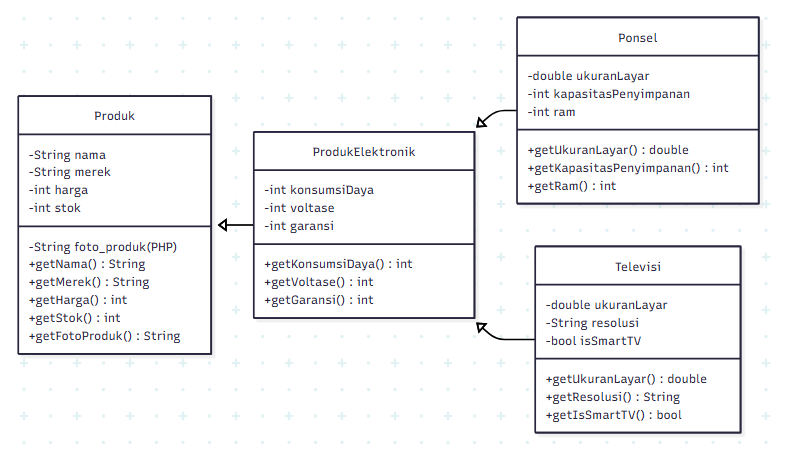

TP2 DPBO

Saya M. Raffa Mizanul Insan dengan NIM 2409119 mengerjakan TP 2 dalam mata kuliah Desain Pemrograman Berorientasi Objek untuk keberkahan-Nya maka saya tidak akan melakukan kecurangan seperti yang telah di spesifikasikan Aamiin.

## Diagram

## Penjelasan Atribut dan Methods

### 1. Class `Produk`

Merupakan kelas dasar yang menjadi fondasi bagi semua jenis produk.

**Atribut**
| Nama Atribut | Deskripsi |
| --- | --- |
| `nama` | Nama lengkap dari produk (misal: "Galaxy S25"). |
| `merek` | Merek produsen produk (misal: "Samsung"). |
| `harga` | Harga jual produk dalam bentuk angka. |
| `stok` | Jumlah unit produk yang tersedia. |
| `foto_produk`| **(Khusus PHP)** Nama file gambar (misal: "s25.jpg"). |

**Methods**
| Nama Method | Deskripsi |
| --- | --- |
| `constructor` | Menginisialisasi objek baru dengan data awal. |
| `get...()`/`set...()` | Kumpulan method Getter dan Setter untuk mengakses dan mengubah nilai setiap atribut secara aman. |

### 2. Class `ProdukElektronik`

Merupakan kelas turunan dari `Produk` dan menjadi kelas dasar untuk semua produk elektronik.

**Atribut Tambahan**
| Nama Atribut | Deskripsi |
| --- | --- |
| `konsumsiDaya` | Kebutuhan daya produk dalam satuan Watt. |
| `voltase` | Voltase listrik yang digunakan produk dalam satuan Volt. |
| `garansi` | Lama masa garansi produk dalam satuan bulan. |

**Methods**
| Nama Method | Deskripsi |
| --- | --- |
| `constructor`| Menginisialisasi objek dengan data produk umum dan data produk elektronik. |
| `get...()`/`set...()` | Getter dan Setter untuk atribut spesifik produk elektronik. |

### 3. Class `Ponsel`

Merupakan kelas turunan dari `ProdukElektronik` yang khusus merepresentasikan produk ponsel.

**Atribut Tambahan**
| Nama Atribut | Deskripsi |
| --- | --- |
| `ukuranLayar` | Ukuran diagonal layar dalam satuan inci. |
| `kapasitasPenyimpanan`| Kapasitas penyimpanan internal dalam satuan Gigabyte (GB). |
| `ram` | Kapasitas memori (RAM) dalam satuan Gigabyte (GB). |

**Methods**
| Nama Method | Deskripsi |
| --- | --- |
| `constructor`| Menginisialisasi objek dengan semua data yang diwarisi dan data spesifik ponsel. |
| `get...()`/`set...()` | Getter dan Setter untuk atribut spesifik ponsel. |

### 4. Class `Televisi`

Merupakan kelas turunan dari `ProdukElektronik` yang khusus merepresentasikan produk televisi.

**Atribut Tambahan**
| Nama Atribut | Deskripsi |
| --- | --- |
| `ukuranLayar` | Ukuran diagonal layar dalam satuan inci. |
| `resolusi` | Resolusi layar televisi (misal: "4K UHD"). |
| `isSmartTV` | Penanda (boolean) yang menunjukkan apakah televisi memiliki fitur Smart TV. |

**Methods**
| Nama Method | Deskripsi |
| --- | --- |
| `constructor`| Menginisialisasi objek dengan semua data yang diwarisi dan data spesifik televisi. |
| `get...()`/`set...()` | Getter dan Setter untuk atribut spesifik televisi. |

---

## Alur Program

Alur program dibagi menjadi dua jenis: aplikasi konsol (CLI) dan aplikasi web.

### 1. Alur Aplikasi Konsol (C++, Java, Python)

Aplikasi yang berjalan di terminal ini memiliki alur sebagai berikut:
1.  **Inisialisasi**: Program dimulai, dan 5 objek produk (campuran `Ponsel` dan `Televisi`) langsung dibuat dan disimpan dalam sebuah *list* atau *vector*.
2.  **Menu Utama**: Sebuah *loop* akan terus-menerus menampilkan menu utama kepada pengguna, yang berisi pilihan untuk menambah produk, menampilkan semua produk, atau keluar.
3.  **Tambah Produk**: Jika pengguna memilih opsi "Tambah", program akan menanyakan jenis produk yang akan dibuat (Ponsel atau Televisi). Selanjutnya, pengguna akan diminta untuk memasukkan semua detail yang relevan untuk produk tersebut, mulai dari atribut dasar (nama, harga) hingga atribut spesifik (ukuran layar, RAM, dll.). Objek baru kemudian dibuat dan ditambahkan ke dalam daftar.
4.  **Tampilkan Semua Produk**: Jika pengguna memilih opsi "Tampilkan", program akan mencetak sebuah tabel dinamis di konsol. Logika ini bekerja dalam dua langkah:
    * **Langkah Pertama**: Program akan menganalisis seluruh data produk yang ada untuk menentukan lebar maksimum yang dibutuhkan untuk setiap kolom agar tabel terlihat rapi.
    * **Langkah Kedua**: Program akan mencetak tabel baris per baris, menggunakan lebar yang sudah dihitung untuk memformat data dengan benar. Ini memastikan semua informasi produk, baik yang umum maupun yang spesifik, ditampilkan dalam satu tabel yang terstruktur.
5.  **Keluar**: Jika pengguna memilih opsi "Keluar", program akan berhenti. Untuk C++, program juga akan secara eksplisit membersihkan memori yang telah dialokasikan.

### 2. Alur Aplikasi Web (PHP)

Implementasi PHP dirancang sebagai halaman web statis yang hanya menampilkan data, dengan alur yang lebih sederhana:
1.  **Inisialisasi**: Ketika halaman `index.php` diakses melalui browser, script akan memuat semua file kelas yang diperlukan.
2.  **Data Statis**: 5 objek produk (campuran `Ponsel` dan `Televisi`) langsung dibuat dan disimpan dalam sebuah *array*. Data ini bersifat *hardcoded* dan tidak dapat diubah melalui antarmuka web.
3.  **Render Tampilan**: Script kemudian menghasilkan output berupa dokumen HTML lengkap beserta CSS untuk styling.
4.  **Tampilan Tabel HTML**: Data produk dari *array* ditampilkan dalam sebuah tabel HTML. Setiap baris tabel merepresentasikan satu produk, menampilkan atribut-atribut utamanya seperti foto, nama, merek, harga, dan stok.
5.  **Pencarian**: Halaman web dilengkapi dengan fitur pencarian sederhana menggunakan JavaScript yang memungkinkan pengguna untuk memfilter produk yang ditampilkan di tabel berdasarkan nama atau merek secara *real-time* tanpa perlu me-reload halaman.
